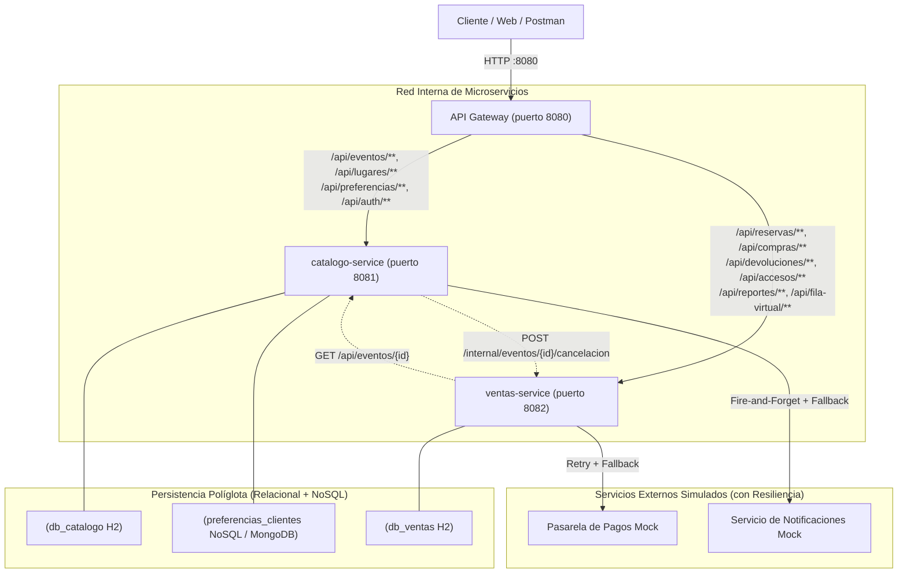

# TicketYa - Plataforma de Venta de Entradas (TUDAI - UNICEN)

**Trabajo Práctico de Arquitectura Web (2026) - Sistema Completo (Entrega 1 + Entrega 2)**

---

## Arquitectura del Sistema

El sistema está diseñado bajo una arquitectura de microservicios con Spring Boot, API Gateway, persistencia relacional independiente por servicio (H2 file-based), almacenamiento documental NoSQL para preferencias de clientes (MongoDB / JSON Document Store), autenticación con JWT, cache con TTL, resiliencia y trazabilidad distribuida (`X-Correlation-Id`).


```mermaid
graph TD
    Client["Cliente / Web / Postman"] -->|HTTP :8080| Gateway["API Gateway (puerto 8080)"]

    subgraph RedInterna ["Red Interna de Microservicios"]
        Gateway -->|"/api/eventos/**, /api/lugares/**<br/>/api/preferencias/**, /api/auth/**"| CatService["catalogo-service (puerto 8081)"]
        Gateway -->|"/api/reservas/**, /api/compras/**<br/>/api/devoluciones/**, /api/accesos/**<br/>/api/reportes/**, /api/fila-virtual/**"| VenService["ventas-service (puerto 8082)"]
        CatService -.->|"POST /internal/eventos/{id}/cancelacion"| VenService
        VenService -.->|"GET /api/eventos/{id}"| CatService
    end

    subgraph BasesDatos ["Persistencia Políglota (Relacional + NoSQL)"]
        CatService --- DBCat["(db_catalogo H2)"]
        CatService --- DBMongo["(preferencias_clientes NoSQL / MongoDB)"]
        VenService --- DBVen["(db_ventas H2)"]
    end

    subgraph Externos ["Servicios Externos Simulados (con Resiliencia)"]
        VenService -->|Retry + Fallback| Pasarela["Pasarela de Pagos Mock"]
        CatService -->|Fire-and-Forget + Fallback| Notif["Servicio de Notificaciones Mock"]
    end
```

---

## Microservicios y Puertos

| Microservicio | Puerto | Responsabilidad Principal |
|---|---|---|
| **api-gateway** | `8080` | Punto de entrada único, ruteo a servicios y Swagger UI unificado |
| **catalogo-service** | `8081` | Lugares, Sectores, Eventos, búsqueda multicriterio, Cache, Preferencias NoSQL, Recomendaciones, Notificaciones y Auth JWT |
| **ventas-service** | `8082` | Reservas temporales (10 min), Fila Virtual, No doble venta, Pagos con Resiliencia, QR, Control de Acceso QR y Reportes |

---

## Instrucciones de Ejecución

### Opción A: Levantar todo el sistema con Docker Compose (Entrega 2)

```powershell
docker compose up --build
```
Esto levanta en contenedores separados: `mongodb-preferencias` (`:27017`), `catalogo-service` (`:8081`), `ventas-service` (`:8082`) y `api-gateway` (`:8080`).

### Opción B: Ejecución Local (en terminales separadas, requiere Java 17+)

1. **Catalogo Service:**
```powershell
cd catalogo-service
.\mvnw spring-boot:run
```

2. **Ventas Service:**
```powershell
cd ventas-service
.\mvnw spring-boot:run
```

3. **API Gateway:**
```powershell
cd api-gateway
.\mvnw spring-boot:run
```

---

## Documentación Técnica y Colecciones de Prueba

* **Diseño, Arquitectura, Decisiones Tecnológicas e Informe de Carga:** [docs/arquitectura.md](docs/arquitectura.md)
* **Features y User Stories (F1 a F12 / US-01 a US-23):** [docs/user-stories.md](docs/user-stories.md)
* **Listado de Endpoints (Entrega 1 + Entrega 2):** [docs/endpoints.md](docs/endpoints.md)
* **Colección de Postman y Datos de Prueba (Seed Data):** [docs/TicketYa-Entrega1.postman_collection.json](docs/TicketYa-Entrega1.postman_collection.json) y carpeta `postman/`

### Documentación OpenAPI (Swagger)
Con los servicios levantados, entrar a **http://localhost:8080/swagger-ui.html** y elegir `catalogo-service` o `ventas-service` arriba a la derecha.
